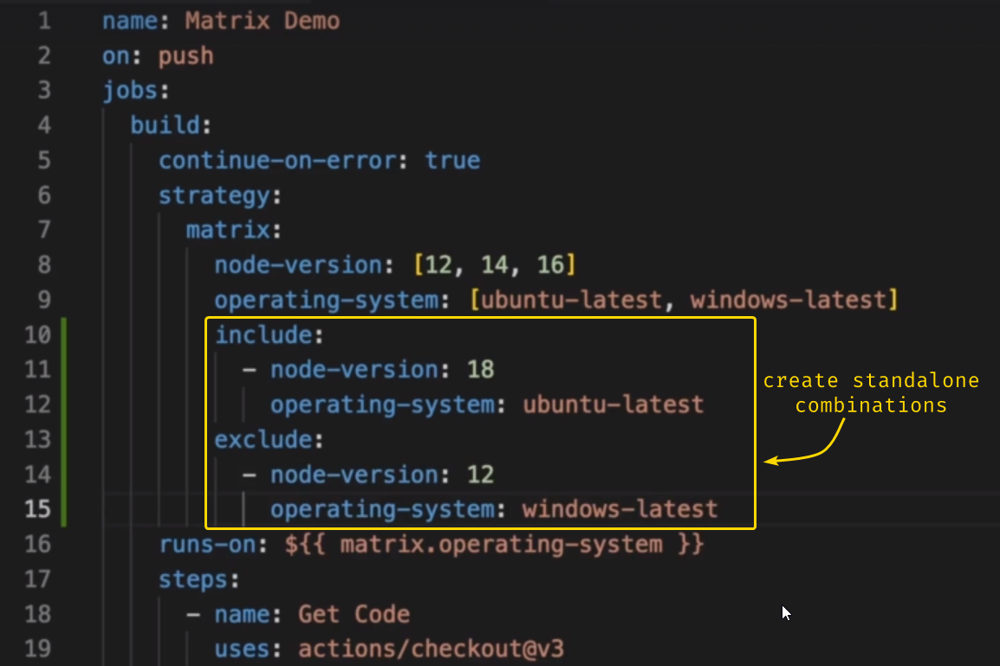
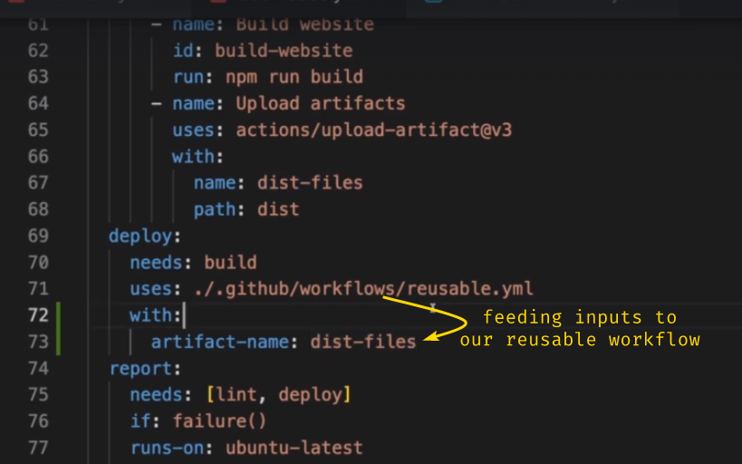
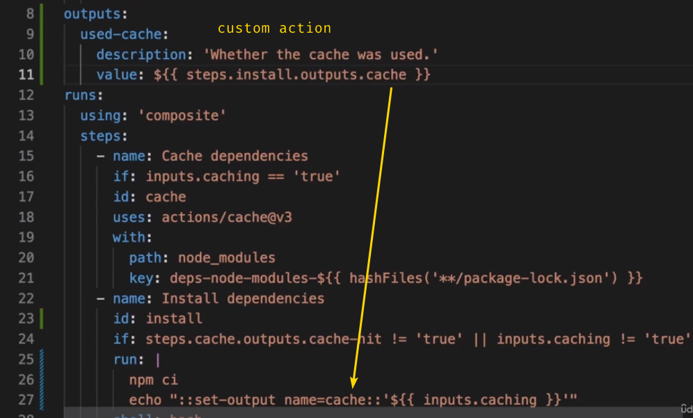

# Basics

Workflows v/s Jobs v/s Steps

|              |                                    Workflows                                     |                                Jobs                                |            Steps            |
| ------------ | :------------------------------------------------------------------------------: | :----------------------------------------------------------------: | :-------------------------: |
| Running flow | Triggered by events. Use concurrency groups to prevent parallel workflow trigger |                       Parallel or Sequential                       |         Sequential          |
| New Runner   |                                                                                  | Every job uses separate runner completely isolated from each other | Get executed on same runner |

> [!NOTE] Failed parent job and dependent job
> By default: Dependent jobs don't get executed if their `needs` job get failed

#### Metadata (context)

Can be accessed via `run: ${{ github }}`
Make more readable (parse to JSON) `run: ${{ toJSON(github) }}`
### Workflow file template

> [!NOTE]- Required keys
> - name (name of workflow)
> - on ([trigger_events](https://docs.github.com/en/enterprise-cloud@latest/actions/using-workflows/events-that-trigger-workflows))
> - job
> 	- needs (single job or array of jobs which need to run before)
> 	- <job_name>
> 	- runs-on (runner type)
> 	- steps
> 		- name (step name)
> 		- run (command to run) | uses (use action from marketplace)

> [!question]- How to run Multiple Bash cmds in single run block? 
> using `|` `|-` (used to put multiline cmds in YAML)
>
```yaml
...
	run: |
	echo "First output"
	echo "Second output",
```

#### Trigger events


Reusable workflows
- Referencing workflows: a single folder can have multiple different `.yml` workflows that can be referenced
- Referencing custom actions: unlike workflows, a custom action is defined within it's own folder and referenced using that folder's path


# Hands-on

1. [actions-katas](https://github.com/eficode-academy/github-actions-katas)
2. Udemy Course
	- [ ] basic workflow with manual trigger + parallel jobs + sequential steps
	- [ ] 

# Practice Ques.

- Where are workflows stored?
- Which lang are actions written in?
- 

# Queries

- How to use both `run` and `uses` in a single step?
	
- how to communicate + exchange data between different jobs (since they are on different runners)
- is there are common storage to share between different runners?
- how to implement package & artifact caching to speed up jobs?
	- where is this cache stored and what's its life?
		- in case of GE Cloud v/s Self hosted runners?
	- we *SHOULD NOT* cache artifacts. WHY?
- how to use different runners within steps
- how to use same codeblocks across different jobs (avoid redundancy)? Is there a way to define a template with variables?
- for a job which depends on previous job => how to continue execution even though parent job failed?
- does steps/env override jobs/env variables that are of same name?
- how to use some env variables from repository scoped environments as well as some from manually created environments

> [!TODO] TODO
> - action vs workflow
> - rewatch publish download artifact video and what's the use of `id:`?
> - 


---

## **SCRIBBLE**


[Filter pattern cheat-sheet](https://docs.github.com/en/actions/using-workflows/workflow-syntax-for-github-actions#filter-pattern-cheat-sheet)


[default environment variables](https://docs.github.com/en/actions/learn-github-actions/variables#default-environment-variables)


different ways to access env variables:


the secrets get hidden similar to Jenkins output




re-usable workflows





docker:


Communicating with service containers when job running on container

Communicating with service containers when job running on runner


Accessing outputs of custom actions



### stuff to do
- getting info + cancelling + skipping a workflowo using REST API
	- [skip workflow runs](https://docs.github.com/en/actions/managing-workflow-runs/skipping-workflow-runs)
- read up docker integration on docker in detail
- learn about security hardening for github runners + actions
	- find tools which can scan for vulner.
	- 

### Outline

- runner types
- trigger events
	- activity types
		- pull_request
			- from collaborators
			- from forks
	- event filters
- artifacts
	- rest API
	- other actions
		- using upload/download-artifact
- outputs 
- variables + env variables + secrets
	- default github environment variables
		- their alternative context referencing
	- vars. | env. | secrets.
	- [other contexts](https://docs.github.com/en/actions/learn-github-actions/contexts#about-contexts)
	- different environment
		- protection rules
	- PR execution attach
- cancelling + skipping workflow runs
- controlling flow
	- ignore failing steps
		- continue-on-error
	- if
	- special functions
		- failure()
		- success()
		- always()
		- cancelled()
- matrix jobs
- reusable workflows
	- using other local .yml workflows
	- custom actions (defined at folder level)
		- js, docker, composite
- docker
	- containers for main job
	- service containers
*Template*
- name
- on
	- workflow_call
		- inputs
		- outputs
		- secrets
- env
- jobs
	- env
	- runs-on
	- strategy
		- matrix
			- include
			- exclude
	- container
	- concurrency
	- needs
	- permissions
	- if
- steps
	- env
	- uses
		- with
	- run
	- if
	- name
	- shell


## Documentation Reference

- Workflow Trigger Events - https://docs.github.com/en/actions/writing-workflows/choosing-when-your-workflow-runs/events-that-trigger-workflows
- Workflow Syntax (jobs. on. env permissions run-name) - https://docs.github.com/en/actions/writing-workflows/workflow-syntax-for-github-actions
	- Expressions - https://docs.github.com/en/actions/writing-workflows/choosing-what-your-workflow-does/evaluate-expressions-in-workflows-and-actions
	- Context - https://docs.github.com/en/actions/writing-workflows/choosing-what-your-workflow-does/accessing-contextual-information-about-workflow-runs
	- Variables - https://docs.github.com/en/actions/writing-workflows/choosing-what-your-workflow-does/store-information-in-variables
- Pass information between Jobs/Steps - https://docs.github.com/en/actions/writing-workflows/choosing-what-your-workflow-does/passing-information-between-jobs
- Default Environment Variables already available - https://docs.github.com/en/actions/writing-workflows/choosing-what-your-workflow-does/store-information-in-variables#default-environment-variables
- Handle `step` and `job` errors - https://www.kenmuse.com/blog/how-to-handle-step-and-job-errors-in-github-actions

### Misc.

- Trigger workflows using API Calls - https://dev.to/teamhive/triggering-github-actions-using-repository-dispatches-39d1
- Control Github Actions with `gh` CLI
	- https://github.blog/news-insights/product-news/work-with-github-actions-in-your-terminal-with-github-cli/
	- https://www.youtube.com/watch?v=Nn8hYDhmizM