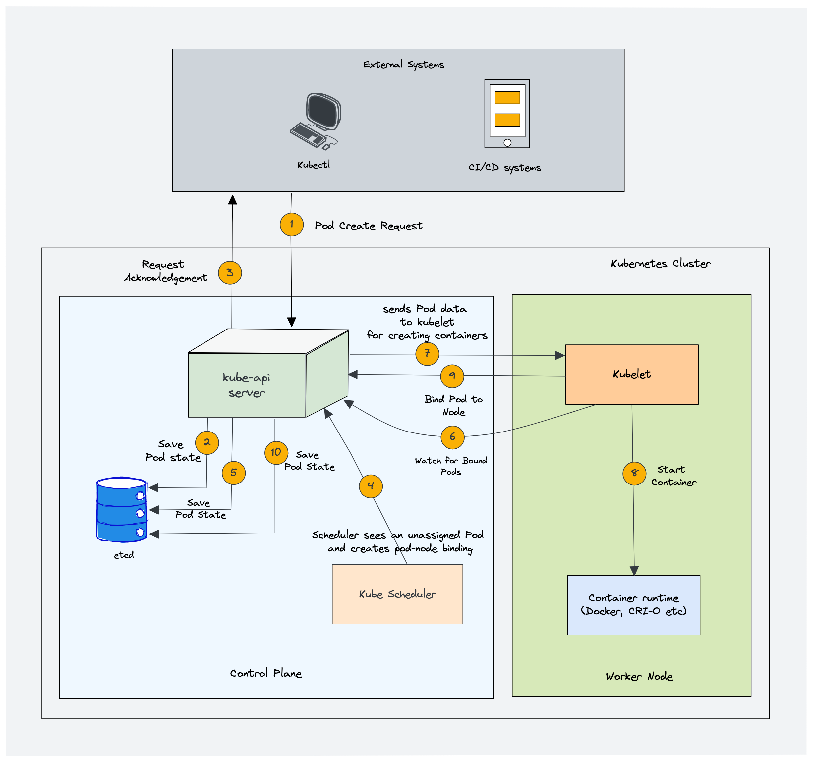
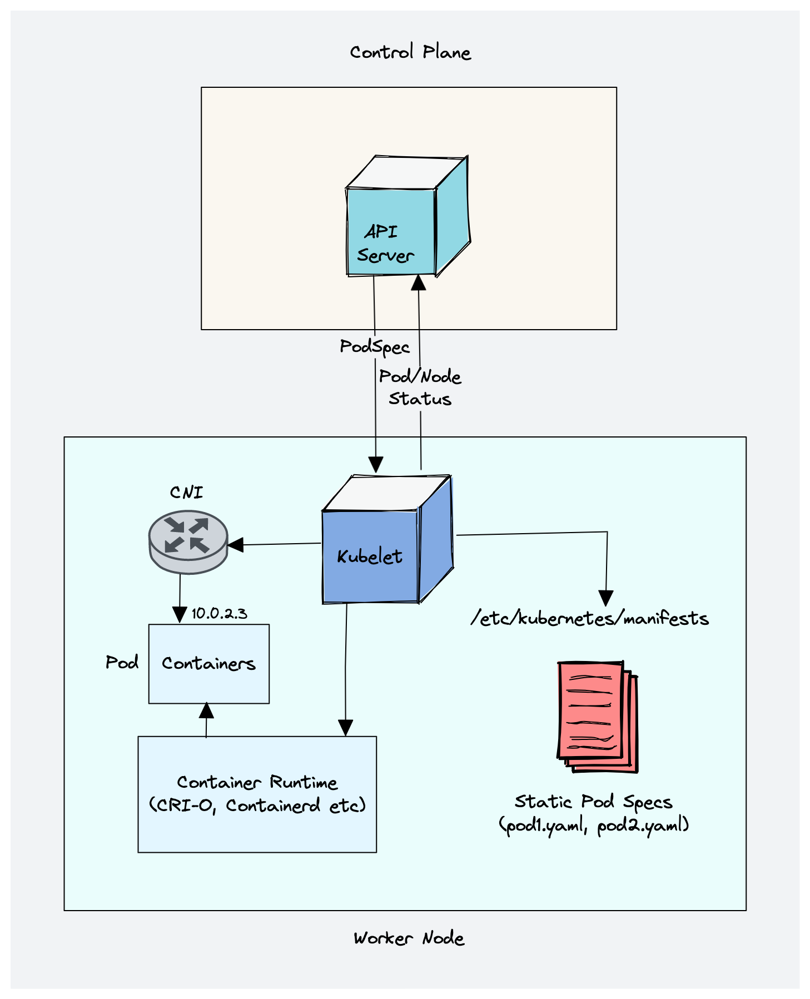
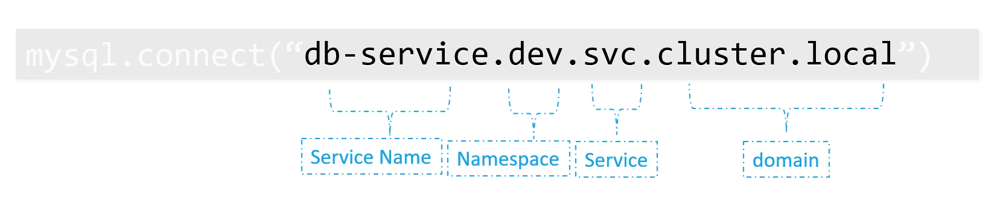
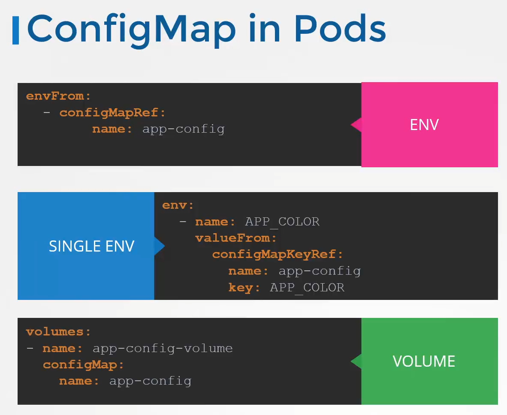

- [[#Kubernetes|Kubernetes]]
	- [[#Kubernetes#CKAD Tricks/Tips|CKAD Tricks/Tips]]
		- [[#CKAD Tricks/Tips#Help yourself out during Exam Time!|Help yourself out during Exam Time!]]
	- [[#Kubernetes#Architecture Diagrams|Architecture Diagrams]]
	- [[#Kubernetes#Basics|Basics]]
		- [[#Basics#Editing Existing Pods|Editing Existing Pods]]
		- [[#Basics#ReplicaSet|ReplicaSet]]
		- [[#Basics#Service|Service]]
		- [[#Basics#Namespaces|Namespaces]]
			- [[#Namespaces#Kubernetes starts with four initial namespaces:|Kubernetes starts with four initial namespaces:]]
		- [[#Basics#Pods|Pods]]
	- [[#Kubernetes#Configuration|Configuration]]
		- [[#Configuration#Controlplane & User configuration|Controlplane & User configuration]]
		- [[#Configuration#configMaps|configMaps]]
		- [[#Configuration#Secrets|Secrets]]
			- [[#Secrets#Encoding/Decoding Secrets to Base64|Encoding/Decoding Secrets to Base64]]
			- [[#Secrets#Storing secrets as volumes|Storing secrets as volumes]]
		- [[#Configuration#Service Accounts|Service Accounts]]
		- [[#Configuration#Container Patterns|Container Patterns]]
		- [[#Configuration#Resource requirements|Resource requirements]]
	- [[#Kubernetes#Networking|Networking]]
		- [[#Networking#Services|Services]]
			- [[#Services#Types|Types]]
		- [[#Networking#Ingress|Ingress]]
		- [[#Networking#Network Policies|Network Policies]]
	- [[#Kubernetes#Observability|Observability]]
		- [[#Observability#Readiness & Liveness Probe|Readiness & Liveness Probe]]
		- [[#Observability#Logging & Monitoring|Logging & Monitoring]]
	- [[#Kubernetes#Pod Design|Pod Design]]
		- [[#Pod Design#Labels, Selectors & Annotations|Labels, Selectors & Annotations]]
		- [[#Pod Design#Deployment Strategies|Deployment Strategies]]
		- [[#Pod Design#Jobs & Cronjobs|Jobs & Cronjobs]]
	- [[#Kubernetes#State Persistance|State Persistance]]
		- [[#State Persistance#PersistantVolume, PersistantVolumeClaims (PV, PVC)|PersistantVolume, PersistantVolumeClaims (PV, PVC)]]
	- [[#Kubernetes#Security|Security]]
		- [[#Security#Authn, Authz, RBAC/ABAC|Authn, Authz, RBAC/ABAC]]
		- [[#Security#Admission Controller|Admission Controller]]
			- [[#Admission Controller#Different ways to get kube-apiserver configuration|Different ways to get kube-apiserver configuration]]
			- [[#Admission Controller#Mutating/Validation Admission Webhook|Mutating/Validation Admission Webhook]]
		- [[#Security#API Groups & Versions|API Groups & Versions]]
			- [[#API Groups & Versions#API Deprecations|API Deprecations]]
		- [[#Security#Kustomize|Kustomize]]
			- [[#Kustomize#Transformers|Transformers]]
				- [[#Transformers#Apply to all resources|Apply to all resources]]
				- [[#Transformers#Overwrite existing fields|Overwrite existing fields]]
			- [[#Kustomize#Patches|Patches]]
- [[#Docker|Docker]]
	- [[#Docker#Basic tasks|Basic tasks]]
	- [[#Docker#Dockerfile tasks|Dockerfile tasks]]
	- [[#Docker#Docker Security|Docker Security]]
- [[#Certification Tips/Resources|Certification Tips/Resources]]
	- [[#Certification Tips/Resources#Practice|Practice]]
		- [[#Practice#Local `minikube` setup for Practice|Local `minikube` setup for Practice]]
	- [[#Certification Tips/Resources#Bootstrap Exam Environment|Bootstrap Exam Environment]]
- [[#Revisit/Revise|Revisit/Revise]]
		- [[#Bootstrap Exam Environment#KodeKloud lab revision notes|KodeKloud lab revision notes]]
			- [[#KodeKloud lab revision notes#Re-watch Videos|Re-watch Videos]]
- [[#FAQ/Ques./Doubts|FAQ/Ques./Doubts]]


# Kubernetes

## CKAD Tricks/Tips

- Get list of all k8s Alias/Resource-Types : `kubectl api-resources`
  (similar to `Ctrl + A` in k9s)
- Avoid writing .yaml structure from scratch : `--dry-run=client -o yaml`
	- `kubectl -n namespace create deploy app --image=nginx:stable --replicas=2 --dry-run=client -o yaml > app-deploy.yaml` *OR* `kubectl -n namespace create deploy app --image=nginx:stable --replicas=2 --dry-run=client -o yaml | vim -`
- Reference Docs during test:
	- https://kubernetes.io/docs/reference/generated/kubectl/kubectl-commands
	- https://kubernetes.io/docs/reference/kubectl/quick-reference/
- **Not sure about the syntax of particular command?**
	- `kubectl explain <resource>`
		- Eg. `kubectl explain deployment --recursive` and pick any specific field to get description for it `kubectl explain pods.spec.containers`
- Running a temporary pod to troubleshoot connectivity
	- `kubectl run tmp --image nginx:alpine --restart=Never --rm -it -- /bin/sh`
	- If possible you can use `nicolaka/netshoot` image that contains a huge amount of utilities for troubleshooting instead of `nginx:alpine`

### Help yourself out during Exam Time!

TASK: Create a taint for a node named `node01`
- Let's open the current yaml in VIM to check it's properties: `kubectl get node node01 -o yaml | vim -` (**Use `vim -` to directly open from stdin**)
- Hmm... no taints are applied, let's apply one ==> *Shit! what's the syntax for taints?*: `kubectl explain node --recursive` OR `kubectl taint -h` (You'll get some example usages as well)
- Okay, so I just need to edit the yaml and it will be automatically applied right? *NOPE, not always*, sometimes you gotta force replace the resource with updated yaml manifest: `kubectl replace --force -f /tmp/file/path/stored/by/vim.yaml`
	- Oops, what was the `tmp` file name again in Vim?: `Ctrl + G`

> [!tip] Setup Alias
> Append to `~/.bashrc` for easy view + search within vim
> `kgv() { kubectl "$@" -o yaml | vim - }`
> Now you can call any command as follows: `kgv get pod <pod_name>`, `kgv describe node node01`, etc.

## Architecture Diagrams

- High-level Design
  
- Controlplane Components
	- kube-apiserver
	  
	- etcd
	  
	- kube-scheduler
	  
	- Controller manager
	  
		- Cloud controller managers (Eg. AWS, GCP, Azure etc)
		  
- Worker Node Components
	- kubelet
	  
	- kube-proxy
	  
	- container runtime
	  
	- 

## Basics

### Editing Existing Pods

3 Ways:
*   If you are given a pod definition file (.yaml), edit that file and use it to create a new pod.
*   **If you are not given a pod definition file**, you may extract the definition to a file using the below command:
    `kubectl get pod <pod-name> -o yaml > pod-definition.yaml`
    Then edit the file to make the necessary changes, delete, and re-create the pod.
*   To modify the properties of the pod, you can utilize the `kubectl edit pod <pod-name>` command. Please note that only the properties listed below are editable.
    *   spec.containers\[\*\].image
    *   spec.initContainers\[\*\].image
    *   spec.activeDeadlineSeconds
    *   spec.tolerations
    *   spec.terminationGracePeriodSeconds


### ReplicaSet


### Service

- Directly create a `svc` for
	- an existing pod : `kubectl expose pod <pod-name> --port=<port_for_service> --target-port=<port_open_on_container> --name <svc-name>`
	- a new pod : `kubectl run <pod-name> --image <image-name> --port <cluserip-port> --expose`
		- Eg. `kubectl run httpd --image=httpd:alpine --port=80 --expose`
- Accessing a svc within v/s outside of namespace
  
- 


### Namespaces

#### Kubernetes starts with four initial namespaces:

|     Namespace     | Description                                                                                                                                                                                                                                                                              |
|:-----------------:| ---------------------------------------------------------------------------------------------------------------------------------------------------------------------------------------------------------------------------------------------------------------------------------------- |
|     `default`     | Empty namespace selected by default in context                                                                                                                                                                                                                                           |
| `kube-node-lease` | Holds [Lease](https://kubernetes.io/docs/concepts/architecture/leases/) objects associated with each node. Node leases allow the kubelet to send [heartbeats](https://kubernetes.io/docs/concepts/architecture/nodes/#node-heartbeats) so that the control plane can detect node failure |
|   `kube-public`   | This namespace is readable by _all_ clients (including those not authenticated). This namespace is mostly reserved for cluster usage, in case that some resources should be visible and readable publicly throughout the whole cluster                                                   |
|   `kube-system`   | Namespace for objects created by the Kubernetes system                                                                                                                                                                                                                                   |


### Pods


- Force edit a Pod's field (i.e. Recreate a pod with new yaml)
	- `k edit pod <pod_name>`
		- Copy the name of /tmp/<file_path> file
	- `k replace --force -f /tmp/<file_path>`
- Execute a command on a pod
	- `k exec <pod_name> -- <cmd>`
	- Get a interactive shell
		- `k exec <pod_name> -it -- /usr/bin/bash` (replace the path with shell of choice)
		-  

## Configuration

### Controlplane & User configuration

- Where are config files for Controlplane stored at?
	- 
- What tools can be used for debugging Kubernetes installations?
	- `ctr`, `crictl`, `docker` (maybe)
- Where is the Kubernetes config for user stored?
	- 
	- Interact with kubeconfig using `kubectl config -h`
- 

### configMaps




### Secrets


#### Encoding/Decoding Secrets to Base64

- Directly decode a secret: `kubectl get secrets/db-user-pass --template={{.data.password}} | base64 -d`
	- Template uses inline Golang: `kubectl get secrets/db-user-pass --template='{{ range $key, $value := .data }}{{ printf "%s: %s\n" $key ($value | base64decode) }}{{ end }}'`
- 


#### Storing secrets as volumes


### Service Accounts


### Container Patterns


### Resource requirements

- CPU value can be float: `0.1` ~ `100m`
	- Lower limit: `1m`
	- 1 CPU == 1 AWS vCPU or 1 GCP/Azure Core
- Memory syntax
  
  

## Networking

### Services

- If a `spec.type` isn't specified ==> default as `ClusterIP`
- When a NodePort service is created --> a ClusterIP service is created as well
	- The NodePort service routes external traffic to the ClusterIP, which in turn directs it to the appropriate Pods

| `Feature`         | `ClusterIP`                                                                                   | `NodePort`                                                                                                                                                    | `LoadBalancer`                                                                                                                          |
| ----------------- | --------------------------------------------------------------------------------------------- | ------------------------------------------------------------------------------------------------------------------------------------------------------------- | --------------------------------------------------------------------------------------------------------------------------------------- |
| **Exposition**    | Exposes the Service on an internal IP in the cluster.                                         | Exposing services to external clients                                                                                                                         | Exposing services to external clients                                                                                                   |
| **Cluster**       | This type makes the Service only reachable from within the cluster                            | A NodePort service, each cluster node opens a port on the node itself (hence the name) and redirects traffic received on that port to the underlying service. | A LoadBalancer service accessible through a dedicated load balancer, provisioned from the cloud infrastructure Kubernetes is running on |
| **Accessibility** | It is **default** service and Internal clients send requests to a stable internal IP address. | The service is accessible at the internal cluster IP-port, and also through a dedicated port on all nodes.                                                    | Clients connect to the service through the load balancer’s IP.                                                                          |
| **Yaml Config**   | `type: ClusterIP`                                                                             | `type: NodePort`                                                                                                                                              | `type: LoadBalancer`                                                                                                                    |
| **Port Range**    | Any public ip form Cluster                                                                    | 30000 - 32767                                                                                                                                                 | Any public ip form Cluster                                                                                                              |
| **User Cases**    | For internal communication                                                                    | Best for testing public or private access or providing access for a small amount of time                                                                      | widely used For External communication                                                                                                  |

#### Types

- 
- ClusterIP
	- Headless Services: Expose a Pod directly using it's IP without any load-balancing. Set `spec.ClusterIP` to `None` in order to create a Headless service
	  

### Ingress

### Network Policies


## Observability

### Readiness & Liveness Probe


### Logging & Monitoring


## Pod Design

### Labels, Selectors & Annotations

### Deployment Strategies

### Jobs & Cronjobs

## State Persistance

### PersistantVolume, PersistantVolumeClaims (PV, PVC)


> [!TIP]
> - How to make a released PV available for PVC's again?: https://stackoverflow.com/questions/50667437/what-to-do-with-released-persistent-volume

## Security

### Authn, Authz, RBAC/ABAC


- Check if a you or a particular user can perform an action
	- `kubectl auth can-i <kubectl_cmd> --as <user>`
		- Eg. `kubectl auth can-i delete pod`, `kubectl auth can-i get nodes --as user123`
		OR
	- `kubectl <kubectl_cmd> --as <user>`
		- Eg. `kubectl get pods --as dev-user`
- 

> [!FAQ]
> - **Where to find the kube-apiserver settings?**
> 	- *on Controlplane* - `cat /etc/kubernetes/manifests/kube-apiserver.yaml`
> 	- *from within pod* - `kubectl get kube-apiserver-controller-xxx -n kube-system -oyaml`
> - **How to find which resources in k8s are namespace scoped and cluster scoped?**
> 	- All resources: `kubectl api-resources`
> 	- Namespace scoped: `kubectl api-resources --namespaced=true`
> 	- Cluster scoped: `kubectl api-resources --namespaced=false`
> - **How to access the kube-apiserver CLI?**
> 	- `kubectl exec -it kube-apiserver-xxxx -n  kube-system -- kube-apiserver -h | grep enable-admission-plugins`

### Admission Controller

#### Different ways to get kube-apiserver configuration

- On Controlplane
	- Grep the configuration from running process: `ps -ef | grep kube-apiserver` (**READONLY**)
	- Config file location: `vim /etc/kubernetes/manifests/kube-apiserver.yaml` (**Editable**)
- From anywhere
	- `kubectl get pod kube-apiserver-xxx -n kubesystem -oyaml` (**Editable**)
#### Mutating/Validation Admission Webhook

### API Groups & Versions

- Get API version info
```sh
# & runs the command in background
kubectl proxy 8001&

# Run in foregound
kubectl proxy 8001

# curl the API info from the controlplane
curl localhost:8001/apis/authorization.k8s.io

# To stop the running `kubectl` processes already occupying the localhost port
killall kubectl
```
- Enable a different API version
	- add runtime-config to /etc/kubernetes/manifests/kube-apiserver.yaml
	- eg. enable v1aplha1 : `--runtime-config=rbac.authorization.k8s.io/v1alpha1`

#### API Deprecations


### Kustomize

- Kustomize looks for `kustomization.yaml` files (don't change the name)
	```yaml
	# apiVersion and kind are optional (but better to include them...)
	apiVersion: kustomize.config.k8s.io/v1beta1
	kind: Kustomization
	
	# k8s resources you want to manage
	resources:
		- nginx-deployment.yaml
		- relative-path/manifest.yaml
		- <other_yaml_files_you_want_kustomize_to_handle>
	
	# customizations you want to make
	commonLabels:
		company: KodeKloud
	```
	- Run `kustomize build <folder>` to output the rendered values
	- It won't apply any changed to the cluster right away, we'll have to pipe the output as : `kustomize build <folder> | kubectl apply -f -`
	- **BUT here's a shortcut**
		- `kubectl apply -k <folder>` (`-k` uses kustomize)
		- `kubectl delete -k <folder>`
- Managing Directories
	- If you have multiple nested directories within your parent folder
	```plain
	k8s
		api
		db
		cache
		kafka
	```
	- Earlier you'd have to import each file separately within kustomization file `.resources` section
	```yaml
	# root/kustomization.yaml
	resources:
		- api/file1
		- api/file2
		- db/file3
		- cache/file4
		- ...
	```
	- ==> Simply create a separate `kustomization.yaml` file within each directory that manages/mentions it's own resources
	
	```yaml
	# root/api/kustomization.yaml
	resources:
		- file1
		- file2
	```
	- Now we can simply use just replace each individual file reference with folder
	
	```yaml
	# root/kustomization.yaml
	resources:
		- api/
		- db/
		- cache/
		- ...
	```

#### Transformers

##### Apply to all resources

- commonLabel : Add set to labels to all resources (metadata.labels, .selector, .matchLabels, etc.)
	```yaml
	commonLabels:
		org: KodeKloud
	```
- namePrefix/Suffix : Add certain Prefix/Suffix to all metadata.name fields
	```yaml
	namePrefix: KodeKloud-
	nameSuffix: -dev
	```
- Namespace : Add namespace to all resources
	```yaml
	namespace: lab
	```
- commonAnnotations : Add certain annotations to all resources
	```yaml
	commonAnnotations:
		branch: master
	```

##### Overwrite existing fields

- images : Modify certain image name/tag to newer one
	```yaml
	images:
		- name: nginx
		  newName: haproxy
		- name: busybox
		  newTag: 2.4
		- name: tomcat
		  newName: apache
		- newTag: 1.33
	```

#### Patches

Provide more surgical approach to add/remove/replace certain fields (or Targets)

**Inline Patching using JSON 6902 v/s Strategic Merge**

```yaml
# replace deployment name from api-deployment to web-deployment
# Json 6902 Patch
patches:
	- target:
		kind: Deployment
		name: api-deployment
	  patch: |-
	    - op: replace
	      path: /metadata/name
	      value: web-deployment
	- target:
		kind: Deployment
		name: api-deployment
	  patch: |-
		- op: replace
		  path: /spec/replicas
		  value: 5
```

*v/s*

```yaml
# replace deployment name from api-deployment to web-deployment
# Strategic Merge Patch
patches:
	- patch: |-
		apiVersion: apps/v1
		kind: Deployment
		metadata:
			name: api-deployment
		spec:
			replicas: 5
```

**Separate File Patches**

```yaml
# Json 6902
# kustomization.yaml
patches:
	- target:
		kind: Deployment
		name: nginx-deployment
	  path: replica-path.yaml

# replica-path.yaml
- op: replace
  path: /spec/replicas
  value: 5

---

# Strategic Merge
# kustomization.yaml
patches:
	- replica-path.yaml

# replica-path.yaml
apiVersion: apps/v1
kind: Deployment
metadata:
	name: api-development
spec:
	replicas: 5
```


# Docker

>[!important] Cheatsheets
>[Commands](https://github.com/LeCoupa/awesome-cheatsheets/blob/master/tools/docker.sh)
>[A-Z reference](https://github.com/wsargent/docker-cheat-sheet)

## Basic tasks

- Run a docker image and publish/forward port 8282 of host to port 1443 of container
	- `docker run -p 8282:1443 <image_name>`
- Find out what distro is a image based off
	- `docker run <image_name> cat /etc/*release*`
- Build a Docker image (directory has all the dependent/required code + Dockerfile)
	- `docker build path/to/directory -t <image_name>:<optional_tag>`
	- `docker build . -t my-docker-image`
- List
	- docker images : `docker images -a`
	- docker containers
		- currently running : `docker ps`
		- all containers : `docker ps -a`

## Dockerfile tasks

- Take args on `docker run`
  
  
	  Input Value : `docker run my-app 10` --> sleep 10
		  k8s -  `.spec.containers.args[]`
	  Default value : `docker run my-app` --> sleep 5
	  Overide Entrypoint : `docker run --entrypoint shutdown my-app 10` --> shutdown 10
		  k8s - `.spec.containers.command[]` 
- 

## Docker Security

- By default commands within container run as `root` (i.e. `USER 1000`)
	- Change user with `USER <user_id>`
- Full list of Linux Capabilities can be found at: `/usr/include/linux/capability.h`
	- Add/Drop capabilities: `docker run --cap-add MAC_ADMIN <image>` or `docker run --cap-drop KILL <image>`
	- Run container with ALL Capabilities (can directly interfere with Host Machine as well): `docker run --privileged <image>`
- How to set above Security Contexts within k8s?
	- At a Pod level
	  
	- At a container level
	  
- 


# Certification Tips/Resources

QuickStart: [[CKAD#CKAD Tricks/Tips]]

> [!TIP] Reference Links
> *Register*: https://www.cncf.io/certification/ckad/
> *Candidate Handbook*: https://www.cncf.io/certification/candidate-handbook
> *Exam Tips*: https://docs.linuxfoundation.org/tc-docs/certification/tips-cka-and-ckad

> [!abstract] Articles/Blogs
> 
> **Basics**
> - Kubernetes Architecture : https://devopscube.com/kubernetes-architecture-explained/
> - DNS in k8s : https://yuminlee2.medium.com/kubernetes-dns-bdca7b7cb868
> - Essential Vim for CKAD : 
> 	- https://github.com/jamesbuckett/ckad-tips/blob/main/06-just-enough-vi.md
> 	- https://www.vim-hero.com/
> 
> **Troubleshooting**
> - Ingress/Service traffic flow: https://medium.com/@ManagedKube/kubernetes-troubleshooting-ingress-and-services-traffic-flows-547ea867b120

## Practice

| Resource                              | Link                                                                                                                                                                                                           |
| ------------------------------------- | -------------------------------------------------------------------------------------------------------------------------------------------------------------------------------------------------------------- |
| (Github) CKAD Exercises               | https://github.com/dgkanatsios/CKAD-exercises<br>https://github.com/bmuschko/ckad-prep<br>https://github.com/jamesbuckett/ckad-questions                                                                       |
| Kubernetes Challenges                 | https://learn.kodekloud.com/courses/kubernetes-challenges                                                                                                                                                      |
| KodeKloud Labs                        | https://learn.kodekloud.com/courses/udemy-labs-certified-kubernetes-application-developer                                                                                                                      |
| MCQ's (for Concepts)                  | https://udemy.com/course/dive-into-cloud-native-containers-kubernetes-and-the-kcna/learn/quiz/6214776<br>https://udemy.com/course/dive-into-cloud-native-containers-kubernetes-and-the-kcna/learn/quiz/6214814 |
| O'Reilly Labs                         | https://learning.oreilly.com/playlists/2e9fe6dc-2a05-47fe-ae0a-34d6485287cc/                                                                                                                                   |
| KillerCoda Labs                       | https://killercoda.com/killer-shell-ckad                                                                                                                                                                       |
| Interactive Network Policies Tutorial | https://editor.networkpolicy.io/                                                                                                                                                                               |
| 5 Real Exam Ques.                     | https://thospfuller.com/2020/11/09/answers-to-five-kubernetes-ckad-practice-questions-2021/                                                                                                                    |

### Local `minikube` setup for Practice

Ref. https://medium.com/geekculture/cheatsheet-for-kubernetes-minikube-kubectl-5500ffd2f0d5
```sh
# Check exiting profiles
minikube profile list

# Start/Stop a minikube cluster
minikube start --driver=docker --profile=minikube --memory 4096 --cpus=4
minikube stop

# Check Status
minikube status

# Install Kubernetes Dashboard
minikube dashboard

# Get minikube IP
minikube ip
```

## Bootstrap Exam Environment

1. Import following functions into your shell profile i.e. `vim ~/.bashrc`

```bash
#############
# Functions #
#############

# Explain recursively a resource properties and open in Vim for easy searching
# It's ABSOLUTELY NECESSARY to use `"` instead of `'`
krmf() {
	kubectl delete "$@" --force --grace-period=0
}

kad() {
	kubectl apply -f "$@" --validate --dry-run=client
}

kexpr() {
	kubectl explain "$@" --recursive | vim -
}

#########
# Alias #
#########

alias k='kubectl'
alias kg='kubectl get'
alias kd='kubectl describe'
alias krm='kubectl delete'
alias kexp='kubectl explain'
alias kexec='kubectl exec -it'
alias kmock='kubectl "$@" --dry-run=client -oyaml'
alias ka='kubectl apply -f'
alias krepl='kubectl replace -f "$@" --force'
alias kedit='kubectl edit'
alias kubens='kubectl config set-context --current --namespace'
alias kubectx='kubectl config use-context'

# Eg. k run pod --image=nginx $dry
export dry="--dry-run=client"
```

2. Open the `kubectl` imperative commands reference
   
3. Configure Vim environment
```sh
# Create or open 'vim ~/.vimrc'
set nu # show line numbers
set et # expandtab (use space character when tab key used) *
set ts=2 # tabstop *
set sw=2 # shiftwidth *
set sts=2 # softtabstop (Let backspace delete indent) **

set ic # ignorecase when searching in vim
set smartcase

# Indentation
set ai # autoindent (Indent at the same level of the previous line)
set si # smart indent

# Highlighting
set hls # highlightsearch (Highlight search terms)
syntax on # syntax highlighting

# While editing files
# Incase of tab errors
:retab

# * preconfigured in the exam environment
# ** minimum nice to have
```

4. Transfer your `~/.vimrc` & `~/alias` files to each SSH server easily
```bash
# Add your vim settings to `~/.vimrc` & alias to `~/alias`
# Add the following function to your .bashrc
copy() {
	NODE=$2

	scp ~/.vimrc ~/alias "$NODE":~
	ssh "$NODE" 'cat alias >> ~/.bashrc && source ~/.bashrc'
}

# Since CKAD allows you to directly copy 'ssh ckad5206' commands from question
# Just simply execute the above for each different server as follows
copy ssh ckad5206

# Then just paste the copied command again and everything just works!
ssh ckad5206
```

5. Useful Vim keyboard controls:
```vi
hjkl
ESC
i, a
I, A || 0, $
w, e, b
x, s, r
f, F || /, n, N
d, dw, D, dd

yy, p, P
v --> y, p, P

??autocmd FileType yaml setlocal ts=2 sts=2 sw=2 expandtab

Ctrl + G # Display filename
```
# Revisit/Revise

- Cronjob
	- cron syntax
- Job
	- different availble settings, Eg. backofflimit, deadline, compleltions, parallelism, restart, etc.
	- creating job from cronjob
- PV, PVC, SC
- vim
	- how to go to a particular line
	- deleting a word forwards+backwards
	- going to line end and insertion after the last char
- Docker
	- Dockerfile syntax
	- exporting image to oci format tar
	- cricctl ques. in exam?
	- images
		- build, list, running, inspect etc.
		- start/stop, rm, change tag, etc.
	- containers commands
- Deployment
	- minsurge, etc. (rollingupdate)

### KodeKloud lab revision notes

- `env` can be defined at spec and container level?
	- use `env` when single key-value pair from configMap/secret
	- use `envFrom` to populate all key-value pairs from configMap/secret
- `securityContext` can be defined at spec + container level
	- Capabilities add/drop are only at container level
	- `runAsuser` is at both levels
- Why use `"sh", "-c", "sleep 400 && echo "yea"`
	- If we omit `sh -c`, would we have to pass the command into separate array values? Eg. `["sleep","400",...]`
- nodeSelector just selects nodes that match given label but nodeAffinity has advanced operators such as `In, Exists, NotIn, DoesNotExist`
- If no host is matched for Ingress, where do requests get forwarded to?
	- Check the `default-backend-service` flag passed within `nginx` deployment
- Where are configuration manifests stored for Controlplane?
	- `/etc/kubernetes/manifests`
- How to use jq,jsonpath or yq to directly output specific field from a manifest
- 

#### Re-watch Videos

- API Versions/Deprecations
- Kustomize
- 

# FAQ/Ques./Doubts

- **Q.** What is kube-proxy and how to open up a session/process to enable communication to kube-apiserver using it?

- **Q.** How to pass long `sh` commands to commands and args in a pod?

- **Q.** How to port forward a svc/pod/deployment to test out connectivity

- **Q.** What is the use of `-c` arg in `sh -c <commands>`?
	- https://stackoverflow.com/questions/74415133/what-does-sh-c-do

- **Q.** Should you use `--force` within CKAD?

- **Q.** Difference between ReplicaSet vs. StatefulSet vs. DaemonSet vs. Deployments
	- https://semaphoreci.com/blog/replicaset-statefulset-daemonset-deployments