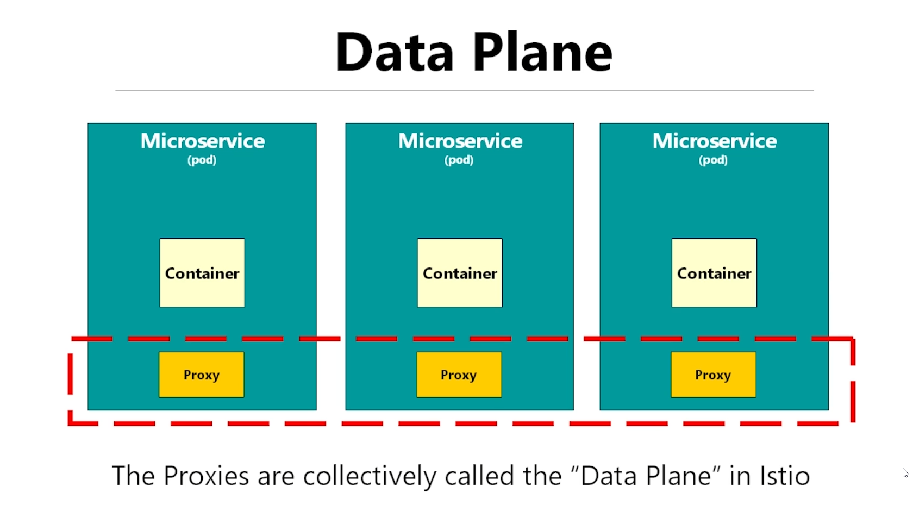

# Basics

**Istio at a very base level is just managed Envoy k8s deployment**
Since Envoy is cross-platform and not just exclusive to k8s and doesn't follow any k8s specific schema, it's difficult to manage the nitty-gritty's directly so *Istio provides abstraction over Envoy to make our lives easier*

> Envoy is just a Proxy and Service Mesh is just one of the use-cases that a Proxy can be used for...

#TroubleshootingTip istiod (Istio Daemon) (Namespace - istio-system) contains most of the functionality of Istio Mesh means it's a single place to configure/log/monitor for any errors
## QQ.

- What's a Data Plane?
	=> All the Envoy Proxy sidecars are collectively called the Data Plane in Istio
	
- How to enable Istio?
	- Namespace level
		- Add the `istio-injection=enabled` to the namespace
		  Quick command: `kubectl label namespace <your_namespace> istio-injection=enabled --overwrite`
	- Pod level
		- Add the `sidecar.istio.io/inject=true` to the pod
	- Automatically enable for all new namespaces
		- Set the `.values.sidecarInjectorWebhook.enableNamespacesByDefault=true` within Helm Chart `values.yaml` file
- List all namespaces/pods with Istio enabled?
  => `kubectl get namespace -L istio-injection` , `kubectl get pods -A -L sidecar.istio.io/inject`
- 

## Troubleshooting using Istio

**Tools**: Kiali + Jaeger

> *For Distributed Tracing to work*: Enable `Header Propagation`
> i.e. extract out `x-request-id` from the HEADERS **if present** and use the same for any other outgoing requests

### Avoiding Cascading Errors within Microservices

- Implement
	- Timeouts (`kind: VirtualService`)
- Security
	- Block all non-TLS traffic
	- Automatically upgrade all traffic to mTLS