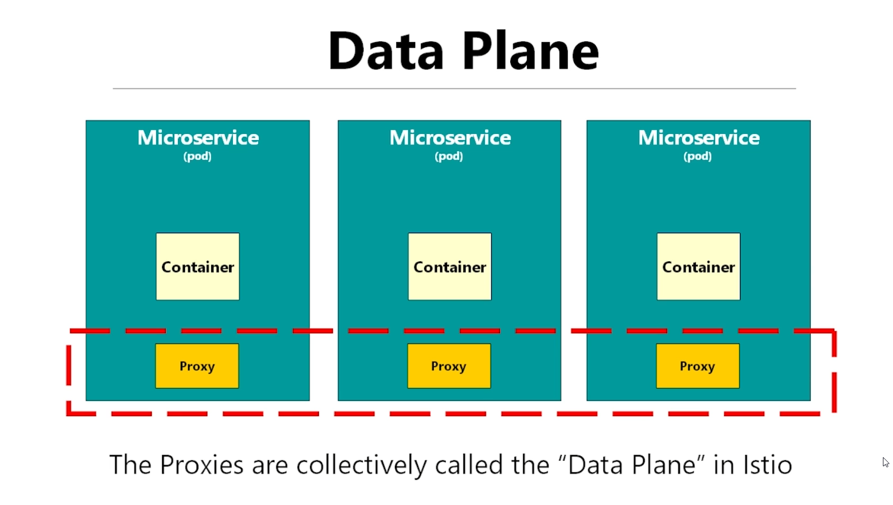

# Basics

**Istio at a very base level is just managed Envoy k8s deployment**
Since Envoy is cross-platform and not just exclusive to k8s and doesn't follow any k8s specific schema, it's difficult to manage the nitty-gritty's directly so *Istio provides abstraction over Envoy to make our lives easier*

> Envoy is just a Proxy and Service Mesh is just one of the use-cases that a Proxy can be used for...

#TroubleshootingTip istiod (Istio Daemon) (Namespace - istio-system) contains most of the functionality of Istio Mesh means it's a single place to configure/log/monitor for any errors
## QQ.

- What's a Data Plane?
	=> All the Envoy Proxy sidecars are collectively called the Data Plane in Istio
	
- How to enable Istio?
	- Namespace level
		- Add the `istio-injection=enabled` to the namespace
		  Quick command: `kubectl label namespace <your_namespace> istio-injection=enabled --overwrite`
	- Pod level
		- Add the `sidecar.istio.io/inject=true` to the pod
	- Automatically enable for all new namespaces
		- Set the `.values.sidecarInjectorWebhook.enableNamespacesByDefault=true` within Helm Chart `values.yaml` file
- List all namespaces/pods with Istio enabled?
  => `kubectl get namespace -L istio-injection` , `kubectl get pods -A -L sidecar.istio.io/inject`
- 

## Troubleshooting using Istio

**Tools**: Kiali + Jaeger

> *For Distributed Tracing to work*: Enable `Header Propagation`
> i.e. extract out `x-request-id` from the HEADERS **if present** and use the same for any other outgoing requests

### Avoiding Cascading Errors within Microservices

- Implement
	- Timeouts (`kind: VirtualService`)
- Security
	- Block all non-TLS traffic
	- Automatically upgrade all traffic to mTLS

## Securing service-to-service comms with mTLS (design answer)

The interview question (Lucidity HM): *"microservices must communicate securely — same cluster, across clusters, or even pod ↔ on-prem."* A **service mesh (Istio) with mTLS** is the standard answer. What mTLS/certs/CA actually *are* → [[TLS & mTLS]]; this section is how the mesh delivers it.

- **istiod is the CA.** Istio runs its own Certificate Authority (the Citadel function inside istiod). It issues each workload a short-lived X.509 certificate and rotates it automatically — no manual cert management.
- **Identity = SPIFFE, not IP/DNS.** Each cert's subject is a SPIFFE ID derived from the workload's service account: `spiffe://<trust-domain>/ns/<namespace>/sa/<service-account>`. Identity is tied to *what the workload is*, not where it runs — so it survives rescheduling and works across clusters.
- **The Envoy sidecar does the mTLS**, transparently. App code is unchanged; the sidecars on both ends present certs, verify each other against istiod's CA, and encrypt the traffic. This is the standard TLS/mTLS handshake ([[TLS & mTLS]]) done for you.
- **Enforce it** with `PeerAuthentication` mode `STRICT` (reject any non-mTLS traffic) + `AuthorizationPolicy` for who-may-call-whom (authZ on top of the mTLS authN).
- **Across clusters:** all clusters must share a **common root of trust** (same root CA feeding each cluster's istiod). Then an **east-west gateway** lets workloads verify each other's SPIFFE identities across the cluster boundary. Same-cluster and multi-cluster are the same mechanism once the root CA is shared.
- **Pod ↔ on-prem / non-mesh peer:** the peer has no sidecar, so either **onboard it to the mesh** (VM/bare-metal onboarding, or issue it a SPIFFE identity via **SPIRE**), or terminate at an **ingress/egress gateway** that does mTLS at the boundary. Naming this edge case (mesh can't assume a sidecar everywhere) is the mature answer.
- **Alternatives to name:** **SPIFFE/SPIRE** directly (mesh-agnostic workload identity), or app-level mTLS with certs from **cert-manager** — heavier, but valid when you don't want a full mesh.