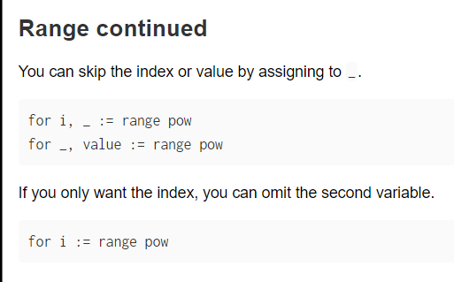
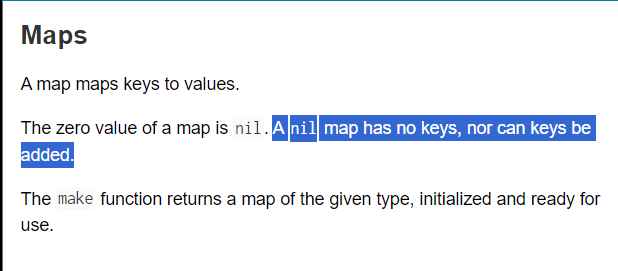
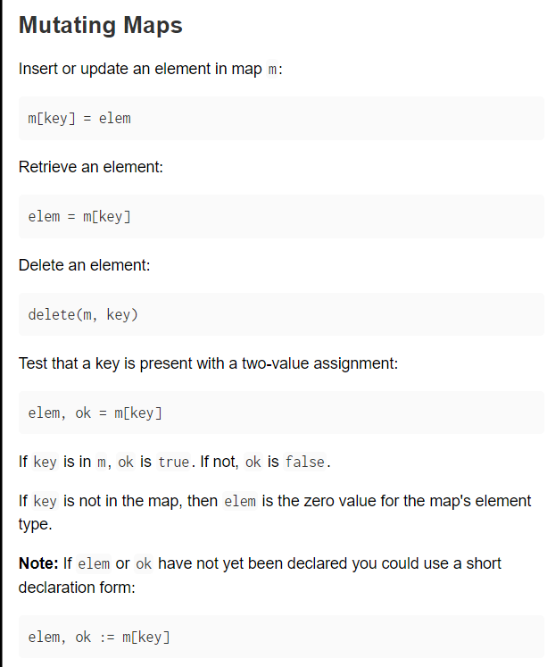
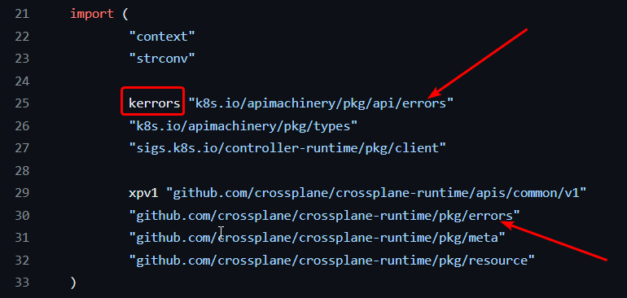

## Data types + Variables

### Declaring var + const

```go
// declare + initialize
var my_var string = "Hello World!"
// declare
var my_var string

// shorthand
my_var := "This is automatically pick type as 'string'"
var a, b, c int = 42, 69, 443
var a, b = 420, "Hello"
c, d := 43.2, true

var(
	a int
	b float = 1.3
	c string = "Yo Yo"
)

// const without a type are flexible
const name = "Dildo"
const f_name, age = "Dil", 2

const name string = "Daddy"
const age int = "barely legal" // WRONG

// ERRORS
// 1. Can't use var with shorthand (:=) declaration
var name := "Ashish"

// 2. Can't change type of var once it's assigned
b := 45
b = "string"

// 3. Can't have different types in same line
var i, j string, int = "Hey!", 33

// 4. Uninitialized constants
const name
name = "Honey"

// 5. Changing const value
const age = 8
age = 18

// 6. Shorthand for const
const age := 8
```

### I/O

```go
//-----taking input-----
var (
	name string
	age int
	ismuggle bool
)
fmt.Scanf("%s %d %t", &name, &age, &is_muggle)
// > Ankit 22 false

// storing scanf output
count, err := fmt.Scanf("%s %d", &a, &b)
// count: No. of args that Scanf writes to
// err: Any errors thrown during input

//-----printing output-----
fmt.Print("Hello wonderful", ", ", "World\n")
fmt.Println()
fmt.Printf("Let's get down to %s cause it's %d:%d PM", "dance floor", 9, minutes)

// find type of var
grades := 80.6
fmt.Printf("Variable grades is: %v and of type: %T", grades, grades)
//OR
import (
	"fmt"
	"reflect"
)

fmt.Printf("Variable grades is: %v and of type: %v", grades, reflect.TypeOf(grades))
```

### Converting Data-types

```go
f := 65.23  // float 65.23
i := int(f) // int 65

// Converting to strings
import (
"fmt"
"strconv"
)

i := 42
var s string = strconv.Itoa(i) // s = "42"
var j int = strconv.Atoi(s)    // j = 42
```

## Operators + Control flow

### if, else, else if

```go
// WRONG Syntax
if fruit == "apple" {
	fmt.print("YES")
}
else {
	fmt.print("NO")
}

// CORRECT Syntax [Notice how else has to start where "}" bracket ends]
if fruit== "apple" {
	fmt.print("YES")
} else {
	fmt.print("NO")
}

// ↓ expression can be evaluated before execution 
if v := math.Pow(x, n); v < lim {
		return v
}
```

### switch-case statement

```go
// by-default if any case is "true" --> execution stops
i := 10
switch i {
	case -5:
		...
	case 10:
		fmt.Print(10)
	case 20:
		fmt.Print(20)
	default:
		fmt.Print("Default")
}
// stdout : 10


// if fallthrough is specified it continues execution till "default" keyword or last fallthrough of other cases regardless of condition match
i := 10
switch i {
	case -5:
		...
	case 10:
		fmt.Print(10)
		fallthrough
	case 20:
		fmt.Print(20)
		fallthrough
	default:
		fmt.Print("Default")
}
// stdout : 1020Default


// conditional cases
i, j := 10, 20
switch {
	case a+b == 30:
		fmt.Print("equal to 30")
	case a + b <= 30:
		fmt.Print("less than or equal to 30")
	default:
		fmt.Print("Default")
}
// stdout : equal to 30
// Golang uses implicit "break" inside each case block
```

### for loop

```go
for i:= 1; i <=5; i++ {
	fmt.Print(i)
}
// 12345

i := 1
for i <= 5 {
	fmt.Print(i)
	i++
}
//12345

i := 1
for {
	i++
}
fmt.Print(i)
// Infinite loop
```

Keywords: `break`, `continue`



## Arrays, Slices, Maps

### Arrays

```go
// same Data-type + fixed length
// declaration
var grades [3]int
var fruits [2]string = [2]string{"Apple", "Kela"}
// OR
var fruits = [2]string{"Apple", "Kela"}

//shorthand
dates := [3]int{4, 8, 10}
// OR
dates := [...]int{4,8,10}


// functions
fmt.Print(len(grades) == cap(grades))
fruits[1] = "Banana" // fruits : ["Apple", "Banana"]


// Looping using for loop
for i := 0; i < len(dates); i++ {
	fmt.Print(dates[i])
}
// OR
for index, element := range fruits {
	fmt.Print(index, "=>", element)
}


// Multi-dimensional arrays
arr := [3][2]int{{2,4}, {4,16}, {8,64}}
```

### Slices

```go
// slice existing arrays
arr := [10]int{1,2,3,4,5,6,7,8,9,10}
slice := arr[1:6] // {2,3,4,5,6}
// OR
slice := []int{2, 3, 4, 5}

// empty slice
// slice := make([]<data_type>, length, capacity)
slice := make([]string, 2, 4) // ref. https://go.dev/tour/moretypes/13
fmt.Print(len(slice) == cap(slice))


// why cap() of slice > actual range sliced?
arr := [10]int{1,2,3,4,5,6,7,8,9,10}
slice := arr[1:7]
fmt.Print(slice, len(slice), cap(slice)) // [2 3 4 5 6 7] 6 9
// slice cap() is taken from start index to end of array regardless of end index


// changing an element in slice ==> changes element in actual array
arr := [10]int{1,2,3,4,5,6,7,8,9,10}
slice := arr[1:6] // {2,3,4,5,6}
slice[2] = 42
fmt.Print(arr, slice) // [1 2 3 42 5 6 7 8 9 10] [2 3 42 5 6]


// Functions
// append()
slice = append(slice, 10, 30, 50)
fmt.Println(arr, slice, cap(slice)) // [1 2 3 42 5 6 10 30 50 10] [2 3 42 5 6 10 30 50] 9
// v/s
slice = append(slice, 10, 30, 50, 70, 90, 110)
fmt.Println(arr, slice, cap(slice)) // [1 2 3 42 5 6 7 8 9 10] [2 3 42 5 6 10 30 50 70 90 110] 18
// if cap() of slice < no. of ele being appended ==> a new array will be created and referenced with x2 the cap()

// copy()
src_slice := []int{1, 2, 3, 4}
dst_slice := make([]int, 2)
num := copy(dst_slice, src_slice)
fmt.Println("Destination slice: ", dst_slice, "No. of elements copied: ", num) // Destination slice:  [1 2] No. of elements copied:  2
```

### Maps

```go
// can't just declare a nil map and later assign values
var my_map map[string]int
my_map['Body Count'] = 69 // ERROR ❌

// delare + initialize
my_map := map[string]int{'Body Count': 69}

// declare non-nil map
my_map = make(map[string]int, 5) // capacity is 5 (Optional param)


// 2 return values of map[key]
value, found = my_map['Body Count'] 
// found is bool whether key exists or not
// if key doesn't exist then found : false and value : default_zero_value


// Functions
// delete
delete(my_map, 'Body Count')
```




## Functions

```go
// Syntax
// func <func_name>(params) <return_type>{ }
func addNumbers(a int, b int) int {
	sum := a + b
	return sum
}

result := addNumbers(2,5) // 7


// Anonymous func.
x:= func(a int, b int) int{
return a * b
}(20, 30)
fmt.Println(x) // 600
```


# For love of go | Learn go with tests | Golang tutorials

Initialize a new module in a folder : `go mod init MODULE_NAME` ([Ref.](https://go.dev/doc/tutorial/call-module-code))
- if planning to publish? : `go mod init github.com/kernel-kun/gophercises/quiz-app`
	- How to import it to another module? : `import "github.com/kernel-kun/gophercises/quiz-app"`
		- But if not yet published online but just initialized : `go mod edit -replace github.com/kernel-kun/gophercises/quiz-app=../quiz-app`
		- Once imported run `go mod tidy` to synchronize changes in go.mod file
- [Project structure standards](https://github.com/golang-standards/project-layout)
- 

## Advanced tutorial

[Fastest Crash Course](https://www.youtube.com/watch?v=8uiZC0l4Ajw)

- String v/s Rune
	- Eg. `len("ʏA") // 3` since len returns size occupied by characters NOT number of characters
	- ==> `import "Unicode/utf8"` and use `utf8.RuneCountInString("ʏA") // 2`

```go
////////////////////
// Error handling //
////////////////////
import "errors"

result, err = intDivide(3, 0)
if err != nil {
	fmt.Println(err.Error())
}else{
	printf("Result is %v", result)
}

func intDivide(a int, b int) (int, err){
	var err error
	if b == 0 {
		err = errors.New("Cannot divide by zero")
		return 0,err
	}
	return a/b, err
}

///////////
// Slice //
///////////
// Appending values using spread ... Operator
slice1 = []int{1, 2, 3}
slice2 = []int{4, 5}
slice2 = append(slice2, slice1...) // slice2 = [1, 2, 3, 4, 5]

/////////////
// Strings //
/////////////
// Accessing elements
myString := "résumé"
myString[1] // é = 114
for i, v := range myString{
	fmt.Println(i, v) // é: i, v = 1, 233  & s: i, v = 3, 115
	// Why index for s began at 3 instead of 2??
}
// Since é in UTF-8 is 233 but it takes 2 byte of space where the first byte represents as 114
// DON'T use python style string methods
// INSTEAD USE `rune`
myString := []rune("résumé")

// stringbuilder which acts as a string array
import "strings"

var strSlice = []string{'a', 'b', 'c'}
var strBuilder strings.Builder

for i := range strSlice{
	strBuilder.WriteString(strSlice["i"])
}
concatString := strBuilder.String()

```

- Goroutines
	- Ref. https://youtu.be/8uiZC0l4Ajw?t=2478
		- go
		- sync.WaitGroup{}
			- .Add(), .Wait(), .Done()
		- sync.Mutex{}
			- .Lock(), .Unlock()
		- sync.RWMutex{}
			- .Lock(), .Unlock(), .RLock(), .RUnlock()

# Read-up | Practice

| Exercises   | Website/Resource                                   | Comments/<br>Notes |
| ----------- | -------------------------------------------------- | ------------------ |
| Gophercises | https://courses.calhoun.io/courses/cor_gophercises |                    |
| Tour of Go  | https://go.dev/tour/                               |                    |
|             |                                                    |                    |

| Topic/Ques.                                              | Article                                                                                                                                                   | Comments/<br>Notes                   |
| -------------------------------------------------------- | --------------------------------------------------------------------------------------------------------------------------------------------------------- | ------------------------------------ |
| What are `go.mod` & `go.sum` files?                      | https://faun.pub/understanding-go-mod-and-go-sum-5fd7ec9bcc34                                                                                             |                                      |
| How to use packages with same name but different modules | https://stackoverflow.com/questions/10408646/how-to-import-and-use-different-packages-of-the-same-name<br><br>https://go.dev/ref/spec#Import_declarations |  |
|                                                          |                                                                                                                                                           |                                      |
|                                                          |                                                                                                                                                           |                                      |
|                                                          |                                                                                                                                                           |                                      |
