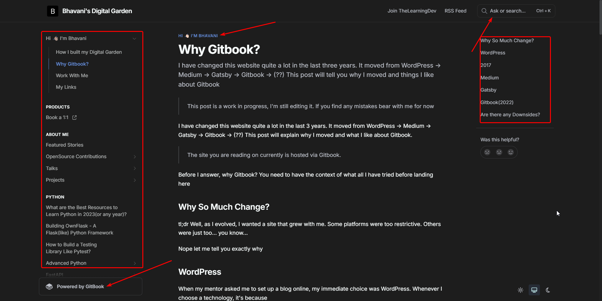
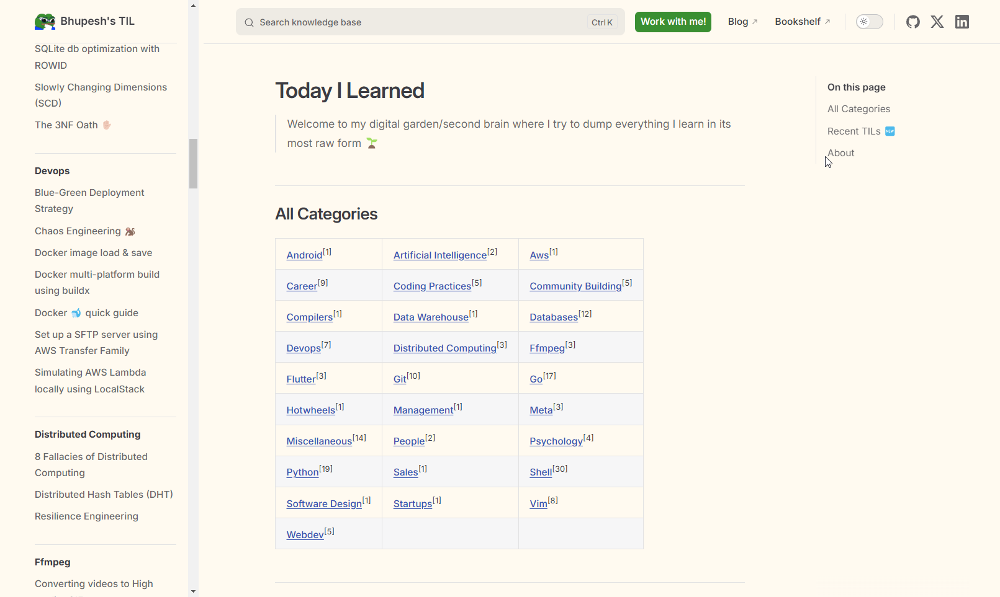
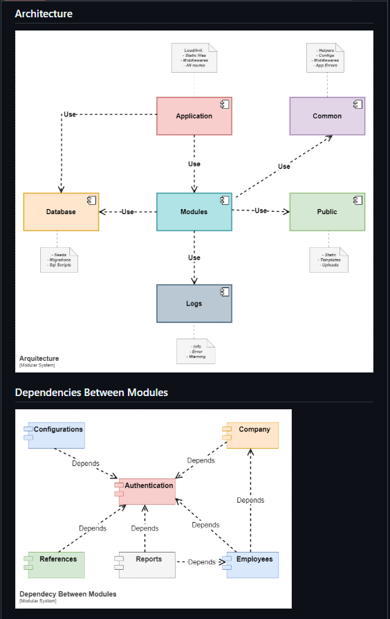
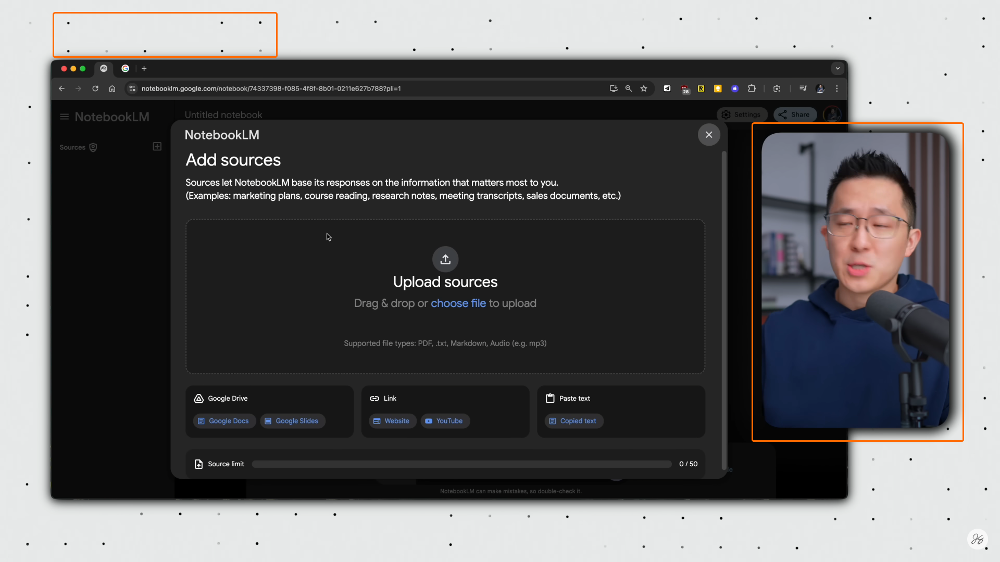

## Inspiration/Improvement areas

| Link                                                                      | Labels                                     | Inspiration                                                                      |
| ------------------------------------------------------------------------- | ------------------------------------------ | -------------------------------------------------------------------------------- |
| https://blog.kubesimplify.com/four-pillars-of-observability-in-kubernetes | #excalidraw, #diagram                      |       |
| https://github.com/zarf-dev/zarf                                          | #diagram, #lucidchart, #k8s                |              |
| https://github.com/Just-Moh-it/HotinGo                                    | #readme, #github                           |                                              |
| https://www.bhavaniravi.com/  https://til.bhupesh.me/               | #website, #notes                           |    |
| https://github.com/ortizdavid/golang-modular-software                     | #golang, #python, #architecture, #diagrams |                                              |
| https://www.youtube.com/watch?v=EOmgC3-hznM                               | #videoediting, #youtube                    |                                              |

## Blogs/Websites

- Medium
- Hashnode
- Dev.to
- daily.dev (for Publicity)
- Kubesimplify
- 

## People

- Rakshit Gondwal
- Rayan Das
- 